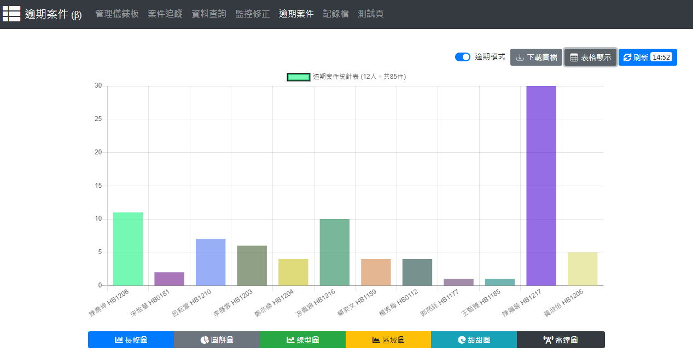

# LAH-API

> 地政中台核心 Web API 服務 (A WEB API for LAH-FE & lah-messenger)



---

## 📖 目錄 (Table of Contents)

- [1. 專案簡介 (Introduction)](#1-專案簡介-introduction)
- [2. 系統架構與資料庫整合 (System Architecture)](#2-系統架構與資料庫整合-system-architecture)
- [3. 目錄結構說明 (Directory Layout)](#3-目錄結構說明-directory-layout)
- [4. 快速安裝與環境建置 (Quick Start & Installation)](#4-快速安裝與環境建置-quick-start--installation)
  - [English Installation Guide](#english-installation-guide)
  - [中文手動安裝說明（以 Windows x64 為例）](#中文手動安裝說明以-windows-x64-為例)
- [5. 環境變數設定與 MOCK 模式 (.env & Configuration)](#5-環境變數設定與-mock-模式-env--configuration)
- [6. 核心 API 模組一覽 (API Modules Overview)](#6-核心-api-模組一覽-api-modules-overview)
- [7. 本機開發與聯調 (Local Development)](#7-本機開發與聯調-local-development)
- [8. 注意事項 (Notes & Limitations)](#8-注意事項-notes--limitations)

---

## 1. 專案簡介 (Introduction)

`LAH-API` 為地政整合中台後端 API 伺服器，主要為以下客戶端提供高可用性、快取加速與異質資料庫存取服務：

- **網頁端前端**：`LAH-FE` (Nuxt.js 2 + BootstrapVue v2 前端管理工作台)
- **桌面應用端**：`lah-messenger` (Electron + Nuxt 2 桌面即時通訊程式)
- **即時通訊推播服務**：`lah-messenger-server` (LAH-WSS Node.js 原生 WebSocket 伺服器)
- **周邊自動化腳本**：包含航空城地籍清冊整理、印表機監控、Tomcat 代理及 Watchdog 服務

---

## 2. 系統架構與資料庫整合 (System Architecture)

系統後端採用 **PHP 7.3** 構建，具備多種異質資料庫連線能力與本地 SQLite 多層快取機制：

| 資料庫類型 | 驅動 / 擴充 | 用途說明 |
| :--- | :--- | :--- |
| **Oracle Database** | `php_oci8_11g.dll` | 核心地政業務資料庫（包含主要 HXWEB、備份 BACKUP、測試 HXT，以及 L1HWEB/L2HWEB/L3HWEB 跨所同步庫） |
| **Microsoft SQL Server** | `php_sqlsrv.dll` | 舊版公文管理、差勤與歷史紀錄查詢庫（`MS_DB_*`, `MS_DOC_DB_*`, `MS_TDOC_DB_*`） |
| **SQLite 3** | `pdo_sqlite` / `sqlite3` | 本地快取（`cache.db`）、代碼檔（`RKEYN.db`）、IP解析（`IPResolver.db`）、維度資料與系統備份設定（`dimension.db`） |

---

## 3. 目錄結構說明 (Directory Layout)

```text
LAH-API/
├── README.md               # 專案說明文件
├── installation.txt        # 詳細手動部署設定筆記
├── php.ini-ref             # 產線 php.ini 參考配置
├── httpd.conf-ref          # 產線 Apache httpd.conf 參考配置
├── snap.jpg                # 系統儀表板畫面預覽
└── www/                    # Web 服務根目錄 (DocumentRoot / ROOT_DIR)
    ├── .env.example        # 環境變數設定範本 (35+ 項非 MSSQL 設定)
    ├── .env                # 實際環境變數檔 (依環境自訂，受 .gitignore 保護)
    ├── composer.json       # PHP 依賴宣告 (PhpSpreadsheet, php-imap 等)
    ├── run_dev_http.bat    # 本機開發用內建 HTTP 快速啟動腳本
    ├── api/                # API 進入點 (共 30+ 支業務 RESTful/JSON API)
    │   ├── auth_json_api.php         # 認證與登入授權
    │   ├── query_json_api.php        # 通用查詢、系統設定與看板資訊
    │   ├── system_json_api.php       # 系統模式開關與代碼檔匯入
    │   ├── reg_json_api.php          # 登記案件業務查詢
    │   ├── sur_json_api.php          # 測量業務查詢
    │   ├── moicas_json_api.php       # MOICAS 相關案件查詢
    │   ├── notification_json_api.php # 訊息與公告通知查詢
    │   └── export_xlsx_api.php       # Excel 統計報表匯出
    ├── include/            # 核心邏輯類別與系統類別庫
    │   ├── init.php                  # 核心引導初始化、Session 與全域自動載入
    │   ├── Env.class.php             # 輕量零依賴環境變數解析核心 (.env 讀取)
    │   ├── System.class.php          # 系統核心設定、權限運算與 MOCK 判斷
    │   ├── GlobalConstants.inc.php   # 全域常數定義
    │   ├── GlobalFunctions.inc.php   # 全域公用函式庫
    │   ├── Cache.class.php           # SQLite 記憶體快取封裝
    │   ├── OraDB.class.php           # Oracle OCI8 資料庫連線底層
    │   ├── MSDB.class.php            # MSSQL SQLSRV 連線底層
    │   ├── SQLiteDBFactory.class.php # SQLite 本地分庫工廠
    │   └── ...                       # 各業務實體類別
    ├── assets/             # 系統資源檔
    │   ├── db/             # SQLite 本地資料庫目錄 (cache.db, dimension.db 等)
    │   ├── img/            # 圖檔與使用者大頭照目錄
    │   ├── files/          # SQL 樣板檔 (.tpl) 與法規參考文件
    │   └── xlsx/           # 統計報表匯出 Excel 樣板
    ├── project/            # 整合子專案 (航空城、印表機監控、Watchdog 等)
    ├── import/             # 批次排程匯入作業目錄
    ├── export/             # 匯出暫存目錄
    └── log/                # 系統運作與錯誤記錄日誌目錄
```

---

## 4. 快速安裝與環境建置 (Quick Start & Installation)

### English Installation Guide

1. **Install Apache & PHP**: Recommended PHP 7.4 Thread Safe (x64) with Apache 2.4 (x64) or AppServ (x64).
2. **Setup PHP Extensions**:
   - Download `php_oci8_11g.dll` (from PECL for Oracle 9i/11g support) and place it in your PHP extensions directory (e.g., `C:\AppServ\php7\ext\`).
   - Download `php_sqlsrv.dll` (for Microsoft SQL Server support) and place it in `C:\AppServ\php7\ext\`.
3. **Configure `php.ini`**:
   - Enable Oracle extension: `extension=oci8_11g` (or `extension=php_oci8_11g.dll`).
   - Enable MSSQL extension: `extension=sqlsrv` (or `extension=php_sqlsrv.dll`).
   - Enable SQLite extension: `extension=pdo_sqlite` and `extension=sqlite3`.
   - Enable additional required modules: `curl`, `fileinfo`, `gd2`, `intl`, `mbstring`, `openssl`, `sockets`.
4. **Install Oracle Instant Client**:
   - Download `instantclient-basic-windows.x64-11.2.0.4.0.zip` from Oracle Official Site.
   - Extract it to a designated path (e.g., `C:\instantclient_11_2`).
   - Add the Instant Client directory (`C:\instantclient_11_2`) and PHP directory to the Windows **System PATH** environment variable.
5. **Deploy Source Files**:
   - Copy all files from the `www/` directory to the web server document root (e.g., `C:\AppServ\www\`).
   - Copy `www/.env.example` to `www/.env` and update the parameters for your environment.
6. **Restart Services / Machine**: Restart Apache (or reboot your computer) to apply all environment variables and extensions.

---

### 中文手動安裝說明（以 Windows x64 為例）

本系統所有環境元件皆為 **Windows x64** 架構，請依照下列步驟進行安裝設定（建議使用具備系統管理員權限之帳戶）：

#### 步驟 1：安裝 Apache 與 PHP 7.4
- 建議安裝路徑範例：
  - Apache24：`D:\DEV\Apache24`
  - PHP 7.4 (Thread Safe x64)：`D:\DEV\php7`
  - Oracle Instant Client：`D:\DEV\instantclient_11_2`

#### 步驟 2：設定系統環境變數 (System PATH)
務必將下列三個路徑加入 Windows 系統環境變數的 `PATH` 中：
1. `D:\DEV\Apache24\bin`
2. `D:\DEV\php7`
3. `D:\DEV\instantclient_11_2`

#### 步驟 3：部署資料庫連線 DLL 擴充套件
1. 下載並複製 **PHP 7.4 x64 Thread Safe** 版本之：
   - `php_oci8_11g.dll` (支援 Oracle 9i / 11g)
   - `php_sqlsrv_74_ts.dll` (支援 Microsoft SQL Server)
2. 放置於 PHP 擴充目錄：`D:\DEV\php7\ext\`

#### 步驟 4：設定 `php.ini`
編輯 `D:\DEV\php7\php.ini`：
1. 確認擴充目錄路徑：`extension_dir = "D:/DEV/php7/ext"`
2. 啟用下列核心模組（移除前面分號或手動加入）：
   ```ini
   extension=curl
   extension=fileinfo
   extension=gd2
   extension=intl
   extension=mbstring
   extension=openssl
   extension=pdo_sqlite
   extension=sqlite3
   extension=sockets
   ; Oracle 連線
   extension=oci8_11g
   ; MSSQL 連線
   extension=sqlsrv_74_ts
   ```

#### 步驟 5：設定 Apache `httpd.conf`
編輯 `D:\DEV\Apache24\conf\httpd.conf`：
1. 在檔案開頭加入 PHP 模組載入設定：
   ```apache
   AddHandler application/x-httpd-php .php
   AddType application/x-httpd-php .php .html
   AddType application/x-httpd-php-source .phps
   LoadModule php7_module "D:/DEV/php7/php7apache2_4.dll"
   PHPIniDir "D:/DEV/php7"
   ```
2. 設定 `DocumentRoot` 指向本專案之 `www` 目錄。
3. 啟用 `mod_headers` 以支援 CORS 跨域存取：
   ```apache
   LoadModule headers_module modules/mod_headers.so
   ```
4. 在 `<Directory "D:/DEV/.../www">` 區塊中加入：
   ```apache
   Header set Access-Control-Allow-Origin "*"
   ```

#### 步驟 6：註冊與啟動 Windows 服務
以管理員身分開啟命令提示字元 (cmd) 執行：
```cmd
httpd.exe -k install
httpd.exe -k start
```
可將 `ApacheMonitor.exe` 設為開機自動啟動以利隨時檢視運行狀態。

---

## 5. 環境變數設定與 MOCK 模式 (.env & Configuration)

本專案支援 **雙軌環境設定架構**，具備「`.env` 優先覆蓋，無設定時自動回退 `dimension.db`」之特性：

### 5.1 設定方式
1. 複製 `www/.env.example` 為 `www/.env`：
   ```bash
   cp www/.env.example www/.env
   ```
2. 編輯 `www/.env` 填入該主機站台所屬之 Oracle IP、所別代碼、WebAP 門檻與金鑰。

### 5.2 MOCK 模式（本機開發免連線 Oracle / MSSQL）
當本機開發無法連線地政內網 Oracle 時，可在 `www/.env` 中開啟 MOCK 模式：

```ini
# 開啟 MOCK 模式（支援 true, false, 1, 0）
MOCK=true
```

- **MOCK 開啟時**：所有地政查詢 API 會優先讀取本地 SQLite 快取或回傳模擬資料，並自動注入本機測試管理者權限，極大加速離線開發效率。
- **MOCK 關閉時**：設為 `MOCK=false` 或註解該行，系統將回退至正式資料庫連線模式。

### 5.3 設定項歸屬分類
- **`.env` 管理（共 35+ 項）**：包含 Oracle 各主機 IP/Port、所別 `SITE`、WebAP JNDI 門檻、推播 WebSocket 參數、監控郵件帳密、API 金鑰等。
- **`dimension.db` 保留管理（共 16 項）**：包含 Microsoft SQL Server 連線參數（`ENABLE_MSSQL_CONN`, `MS_DB_*`, `MS_DOC_DB_*`, `MS_TDOC_DB_*`）。

---

## 6. 核心 API 模組一覽 (API Modules Overview)

所有 API 端點皆位於 `/api/` 目錄下，遵循標準 JSON 回應協定：

```json
{
  "status": 1,
  "message": "處理成功訊息",
  "raw": { ... }
}
```

| API 端點 | 主要功能 | 說明 |
| :--- | :--- | :--- |
| `api/auth_json_api.php` | 登入與身份驗證 | 包含使用者權限驗證、IP 登入檢查與 WebSocket 資訊獲取 |
| `api/query_json_api.php` | 綜合資訊與設定查詢 | 查詢 `configs` 系統參數、綜合看板統計、快照歷史等 |
| `api/system_json_api.php` | 系統模式與代碼維護 | 切換 MOCK/MSSQL 模式、同步匯入 SYSAUTH1 使用者名冊與 RKEYN 代碼 |
| `api/reg_json_api.php` | 登記案件管理 | 逾期管制、未歸檔案件追蹤、地籍異動與外國人地權管控 |
| `api/sur_json_api.php` | 測量案件業務 | 建物滅失追蹤管制、測量延期管制與會同辦理案件查詢 |
| `api/moicas_json_api.php` | 地政核心系統介接 | MOICAS 案件跨所、跨縣市、跨域代收代寄與智慧控管系統查詢 |
| `api/notification_json_api.php`| 訊息與公告通知 | 公告推播、課室廣播紀錄回溯與附檔自動關聯讀取 |
| `api/stats_json_api.php` | 業務統計看板 | 今日案件、各所跨所業務量、謄本核發量即時統計 |
| `api/export_xlsx_api.php` | Excel 報表匯出 | 統計數據轉化並套用官方樣板匯出 Excel 活頁簿 |
| `api/export_txt_data.php` | 地籍匯出與資料打包 | 支援大筆地籍文字檔產出、ZIP 壓縮串流下載與定時清理 |

---

## 7. 本機開發與聯調 (Local Development)

針對日常前後端聯調，可直接使用 PHP 內建伺服器快速啟動：

1. 進入 `www/` 目錄並執行快速啟動批次檔：
   ```cmd
   cd www
   run_dev_http.bat
   ```
   *(等同於執行：`php.exe -S 0.0.0.0:80 -t .`)*

2. 若有啟動前端 `LAH-FE` 或 `lah-messenger`，確保前端代理或 API URL 指向 `http://127.0.0.1:80`。

---

## 8. 注意事項 (Notes & Limitations)

- **不支援 Internet Explorer (NO IE support)**：前端畫面與 API 通訊採用現代標準規範（RFC 5987 UTF-8 Content-Disposition、Fetch/Axios、現代密碼雜湊等），已全面停止支援 IE 瀏覽器。
- **Windows 檔案編碼**：專案內部腳本全面採用 **UTF-8（無 BOM）** 編碼。
- **環境變數安全性**：`www/.env` 包含敏感資料庫密碼與 API 金鑰，已列入 `.gitignore`，切勿將其推播至公開版本控制倉庫。
